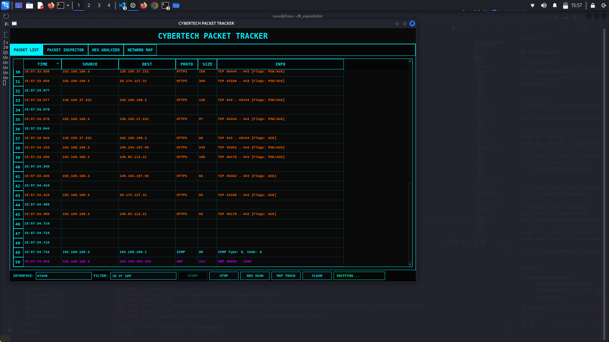

# SniffMap

**CyberTech Packet Tracker**

A cyberpunk-themed network packet analyzer with geolocation capabilities and interactive visualization.



## Features

-  **Real-time packet sniffing** with customizable BPF filters
-  **IP geolocation** with detailed network path visualization
-  **Packet inspection** with detailed protocol analysis
-  **Hex viewer** for raw packet data examination
-  **Interactive cyberpunk-style network map** showing packet routes
-  **Cyberpunk aesthetic** with neon colors and futuristic UI

## Requirements

- Python 3.7+
- Scapy
- PyQt5
- PyQtWebEngine
- requests
- ipaddress
- random

## Installation

1. Clone this repository:
   ```bash
   git clone https://github.com/yourusername/SniffMapper.git
   cd sniffmapper
   ```

2. Install the required dependencies:
   ```bash
   pip install -r requirements.txt
   ```

## Usage

Run the application with root privileges for packet sniffing:
```bash
sudo SniffMapper.py
```

### Interface Controls
- **START**: Begin packet capture with the specified filter
- **STOP**: Halt packet capture
- **GEO SCAN**: Perform geolocation lookup on selected packet
- **MAP TRACE**: Visualize the network path on the cyberpunk map
- **CLEAR**: Reset all displays

### Tabs
1. **PACKET LIST**: Displays captured packets in a sortable table
2. **PACKET INSPECTOR**: Shows detailed protocol information
3. **HEX ANALYZER**: Displays raw packet data in hex format
4. **NETWORK MAP**: Interactive map showing packet routes

## Geolocation Notes

The application uses the free tier of ipinfo.io for geolocation. Be aware of the following:
- Free tier has rate limits (1,000 requests/day)
- Private IP addresses (like 192.168.x.x) cannot be geolocated
- For production use, consider obtaining an API key from ipinfo.io

## Screenshots


*Packet list with color-coded protocols*


*Interactive cyberpunk network map*

## Troubleshooting

If you encounter issues:
1. Ensure you're running as root for packet capture
2. Check your firewall isn't blocking the application
3. Verify you have all dependencies installed
4. For map issues, ensure PyQtWebEngine is properly installed

## Contributing

Pull requests are welcome. For major changes, please open an issue first to discuss what you would like to change.

---

**CyberTech Packet Tracker** - Track packets in style through the neon-lit digital frontier.
